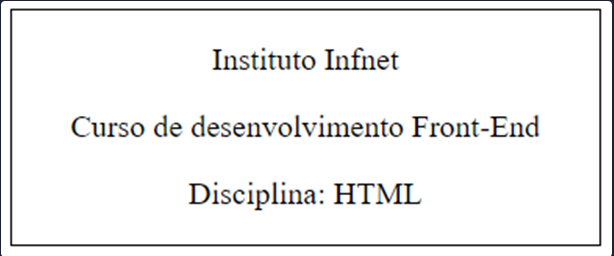

Teste de Performance 1
Exercício 14
ENUNCIADO:
Para esse exercício, recrie o exemplo abaixo:

No arquivo index.html, crie uma tag div que possua 300px de largura

Para a estilização do texto, siga as etapas abaixo:
Borda: 1px solida;
Tipo de fonte: Verdana;
Tamanho de fonte: 12px;
Alinhamento: centralizado horizontalmente;
Espaçamento entre letras: 1.3px;
Cor de texto: Roxo.
OBSERVAÇÕES:
O conteúdo deve seguir o mesmo do exemplo
O conteúdo em texto da div, deve estar dentro de tags 

A estilização deve estar apenas no arquivo style.css